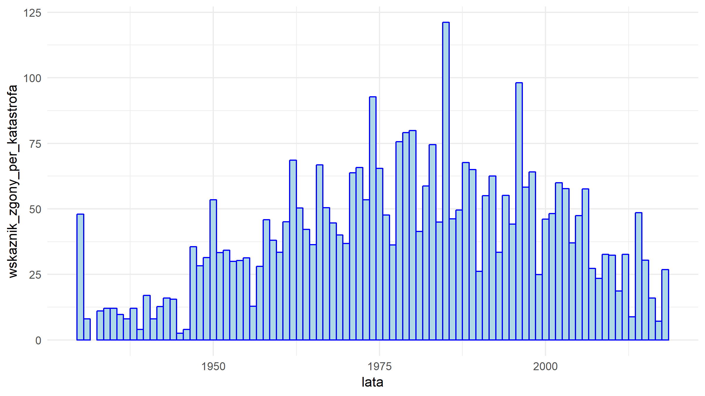

<style>
body {
    overflow: scroll;
    
}

</style>
<meta charset="UTF-8">

Analiza katastrof cywilnych samolotów pasażerskich w latach 1930-2018
========================================================
author: Mikołaj Zapalski Jan Proniewicz
date: 14 styczeń 2019
autosize: true
font-family: 'Myriad Pro'
width: 1920
height: 1080

Krok 1 - pobieramy dane
========================================================


```r
library(rvest)
library(stringr)
library(ggplot2)
url<-"https://pl.wikipedia.org/wiki/Katastrofy_i_incydenty_cywilnych_samolot%C3%B3w_pasa%C5%BCerskich?fbclid=IwAR2tXXC4Z4bFOv6Ml1uVeepVWg2S7EEd53hQ2D3WLABtRH8WFLYf5MIppX8"
x<-url
parse_result<-function(x){
  read_html(x)%>%
    html_nodes("table")%>%
    html_table()->tabele
}

em<-parse_result(url)
new_em <- em[6:94] #wywalam spis tresci i lata z dziurami, czyli te które nas nie interesują
```


Krok 2 - "oczyszczamy" dane
========================================================


```r
N <- 89 # lata 1930 - 2018
J <- 9
M <-12
miesiace <- matrix(c("stycznia", "01", "lutego", "02", "marca", "03", "kwietnia", "04", "maja", "05", "czerwca", "06", "lipca", "07", "sierpnia", "08", "wrze", "09", "pa", "10", "listopada", "11", "grudnia", "12"), 2, 12)
for (n in 1:N) { #"czyszcze dane", ujednolicam format
  new_em[[n]][["Data"]][new_em[[n]][["Data"]]<1] <-str_sub(new_em[[n]][["Data"]][new_em[[n]][["Data"]]<1],start=11)
  dzien <-substr(new_em[[n]][["Data"]],1,2)
  for(m in 1:M){
    new_em[[n]][["Data"]]<-replace(new_em[[n]][["Data"]],grep(miesiace[1,m], new_em[[n]][["Data"]]),paste(toString(n+1929),miesiace[2,m],sep="-"))
  }
  dzien <-gsub(" ","",dzien)
  dzien[strtoi(dzien)<10] <- paste0("0",dzien[strtoi(dzien)<10])
  new_em[[n]][["Data"]]<-paste(new_em[[n]][["Data"]],dzien,sep="-")
  #dane z wikipedii miały raz format "0000-02-1111 lutego" a raz "14 lipca" itp
}
```
Krok 2 - "oczyszczamy" dane cd.
========================================================


```r
for (n in 1:N) {
 for(j in 1:J)
    {
      new_em[[n]][[j]][new_em[[n]][[j]]=='?'] <- NA
    }
    #zamieniam '?' na <NA>
}
superdane <- new_em
#eksportuję sobie do pliku .csv na wszelki wypadek ;)
lapply(superdane, function(x) write.table( data.frame(x), 'superdane.csv'  , append= T, sep=',' ))
```

```
[[1]]
NULL

[[2]]
NULL

[[3]]
NULL

[[4]]
NULL

[[5]]
NULL

[[6]]
NULL

[[7]]
NULL

[[8]]
NULL

[[9]]
NULL

[[10]]
NULL

[[11]]
NULL

[[12]]
NULL

[[13]]
NULL

[[14]]
NULL

[[15]]
NULL

[[16]]
NULL

[[17]]
NULL

[[18]]
NULL

[[19]]
NULL

[[20]]
NULL

[[21]]
NULL

[[22]]
NULL

[[23]]
NULL

[[24]]
NULL

[[25]]
NULL

[[26]]
NULL

[[27]]
NULL

[[28]]
NULL

[[29]]
NULL

[[30]]
NULL

[[31]]
NULL

[[32]]
NULL

[[33]]
NULL

[[34]]
NULL

[[35]]
NULL

[[36]]
NULL

[[37]]
NULL

[[38]]
NULL

[[39]]
NULL

[[40]]
NULL

[[41]]
NULL

[[42]]
NULL

[[43]]
NULL

[[44]]
NULL

[[45]]
NULL

[[46]]
NULL

[[47]]
NULL

[[48]]
NULL

[[49]]
NULL

[[50]]
NULL

[[51]]
NULL

[[52]]
NULL

[[53]]
NULL

[[54]]
NULL

[[55]]
NULL

[[56]]
NULL

[[57]]
NULL

[[58]]
NULL

[[59]]
NULL

[[60]]
NULL

[[61]]
NULL

[[62]]
NULL

[[63]]
NULL

[[64]]
NULL

[[65]]
NULL

[[66]]
NULL

[[67]]
NULL

[[68]]
NULL

[[69]]
NULL

[[70]]
NULL

[[71]]
NULL

[[72]]
NULL

[[73]]
NULL

[[74]]
NULL

[[75]]
NULL

[[76]]
NULL

[[77]]
NULL

[[78]]
NULL

[[79]]
NULL

[[80]]
NULL

[[81]]
NULL

[[82]]
NULL

[[83]]
NULL

[[84]]
NULL

[[85]]
NULL

[[86]]
NULL

[[87]]
NULL

[[88]]
NULL

[[89]]
NULL
```

Analiza
========================================================
Skoro dane są już obrobione przstępujemy do analizy

Wyciągamy wszystkie potrzbne nam informacje, które wykorzystamy w przyszłości

```r
zgony_w_latach<-c()
ocalenia_w_latach<-c()
wszystkie_linie_w_latach<-c()
wszystkie_kraje_w_latach<-c()
ilosc_katastrof_w_latach<-c()

for (n in 1:N){
  zgony_w_latach<-append(zgony_w_latach,sum(strtoi(superdane[[n]][["Ofiary"]]),na.rm = T))
  ocalenia_w_latach<-append(ocalenia_w_latach,sum(strtoi(superdane[[n]][["Ocaleni"]]),na.rm = T))
  wszystkie_linie_w_latach<-append(wszystkie_linie_w_latach,superdane[[n]][["Linie lotnicze"]])
  wszystkie_kraje_w_latach<-append(wszystkie_kraje_w_latach,superdane[[n]][["Miejsce zdarzenia"]])
  ilosc_katastrof_w_latach<-append(ilosc_katastrof_w_latach,length(superdane[[n]][[1]][!is.na(superdane[[n]][["Ofiary"]])]))
}
```

Ocaleni
========================================================


```r
#liczymy wektor wskażników w postaci ocalaleni/wszyscy pasażerowie dla każdego roku osobno 
procent_ocalalalych_w_latach <-round(ocalenia_w_latach/(ocalenia_w_latach+zgony_w_latach),2)

suma_ocalenia<-sum(ocalenia_w_latach)
suma_zgonow<-sum(zgony_w_latach)
round(suma_ocalenia/(suma_ocalenia+suma_zgonow),2)
```

```
[1] 0.47
```

```r
#wniosek -> statystycznie 47% szansy na ocalanie 
```
Ocaleni wykres
========================================================


```r
lata<-c(1930:2018)
aaa<-data.frame(lata,procent_ocalalalych_w_latach)
ggplot(aaa, aes(x=lata, y=procent_ocalalalych_w_latach))+geom_bar(stat="identity", width=1,color="blue",fill="lightblue")+theme_minimal()
```


Ocaleni / katastrofa
========================================================

```r
#ilość ocalałych / ilość katastrof na przestrzeni lat
suma_katastrof <- sum(ilosc_katastrof_w_latach)
wskaznik_ocaleni_per_katastrofa<-ocalenia_w_latach/ilosc_katastrof_w_latach
ccc<-data.frame(lata,wskaznik_ocaleni_per_katastrofa)
ggplot(ccc, aes(x=lata, y=wskaznik_ocaleni_per_katastrofa))+geom_bar(stat="identity", width=1,color="blue",fill="lightblue")+theme_minimal()
```


```r
srednia_ocalalych_per_katastrofa<-round(suma_ocalenia/suma_katastrof) 
print(srednia_ocalalych_per_katastrofa)#statystycznie po każdej katastrofie ocalało średnio ok. 40 osób
```

```
[1] 40
```
Odchylenie standardowe ocaleń
========================================================

```r
#odchylenia standardowe ocalałych w poszczególnych latach
odchylenie_ocalalych_w_latach<-c()

for(n in 1:N){
  odchylenie_ocalalych_w_latach<-append(odchylenie_ocalalych_w_latach,sqrt(sum((strtoi(superdane[[n]][["Ocaleni"]])-wskaznik_ocaleni_per_katastrofa[n])^2,na.rm = T)/ilosc_katastrof_w_latach[n]))
}
fff<-data.frame(lata,odchylenie_ocalalych_w_latach)
ggplot(fff, aes(x=lata, y=odchylenie_ocalalych_w_latach))+geom_bar(stat="identity", width=1,color="blue",fill="lightblue")+theme_minimal()
```


```r
round(sqrt(sum((ocalenia_w_latach-srednia_ocalalych_per_katastrofa)^2)/suma_katastrof)) #w niektórych katastrofach liczba ocalałych odchylała się od średniej o ok. 205 osób
```

```
[1] 205
```
Ocaleni ogólnie
========================================================

```r
#średnia liczba ocalałych ogólnie i odchylenie standardowe
round(mean(ocalenia_w_latach)) #średnio w każdym roku ocalało ok. 488 osób
```

```
[1] 488
```

```r
round(sd(ocalenia_w_latach)) #w niektórych latach liczba ocalałych odchylała się od średniej o ok. 559 osób
```

```
[1] 559
```

Najniebezpieczniejsze linie
========================================================

```r
#najniebezpieczniejsze linie
tabela_linii <-sort(table(wszystkie_linie_w_latach),decreasing = T)
#View(tabela_linii)
tabela_linii[1:10]
```

```
wszystkie_linie_w_latach
                  Aeroflot                        TWA 
                        51                         47 
           United Airlines                     Pan Am 
                        29                         23 
         American Airlines           Turkish Airlines 
                        22                         15 
                Air France          Eastern Air Lines 
                        14                         14 
            China Airlines Polskie Linie Lotnicze LOT 
                        11                         11 
```

```r
#wynika to zapewne ze skalą przedśiębiorstw lotniczych, nie mogłem znaleźć danych
#o ilościach lotów dla lini lotniczych w tamtych latach
plot(tabela_linii[1:10],type='h',lwd=10,las = 2)
```


Najniebezpieczniejsze kraje
========================================================

```r
#najniebezpieczniejsze kraje
# analogicznie do poprzedniego slajdu
tabela_krajow <-sort(table(wszystkie_kraje_w_latach),decreasing = T)
tabela_krajow[1:10] 
```

```
wszystkie_kraje_w_latach
Stany Zjednoczone              ZSRR         Indonezja   Wielka Brytania 
              269                50                39                38 
            Rosja           Francja           Japonia            Kanada 
               32                25                23                21 
           Wlochy             Indie 
               21                19 
```

```r
plot(tabela_krajow[1:10],type='h',lwd=10,las = 2)
```


Czy bezpieczeństwo latania zmieniało się na przestrzeni lat?
========================================================

```r
#ilośc zabitych / ilośc katastrof na przestrzeni lat
wskaznik_zgony_per_katastrofa<-zgony_w_latach/ilosc_katastrof_w_latach
#plot(wskaznik_zgony_per_katastrofa, type='h',xlab="lata")
bbb <- data.frame(lata,wskaznik_zgony_per_katastrofa)
ggplot(bbb, aes(x=lata, y=wskaznik_zgony_per_katastrofa))+geom_bar(stat="identity", width=1,color="blue",fill="lightblue")+theme_minimal()
```


Zgony
========================================================

```r
#stosunek liczby zgonów do liczby ocalałych
stosunek_zgonow_do_ocalalych<-zgony_w_latach/ocalenia_w_latach
ddd<-data.frame(lata,stosunek_zgonow_do_ocalalych)
ggplot(ddd, aes(x=lata, y=stosunek_zgonow_do_ocalalych))+geom_bar(stat="identity", width=1,color="blue",fill="lightblue")+theme_minimal()
```



```r
round(suma_zgonow/suma_ocalenia, 2) #statystycznie na jedną osobę ocalałą po katastrofie przypada jedna/dwie, która/e zginęła/y (stosunek 1.13)
```

```
[1] 1.13
```
Średnia ofiar z wszystkich katastrof
========================================================

```r
srednia_zgonow_per_katastrofa<-round(suma_zgonow/suma_katastrof) 
print(srednia_zgonow_per_katastrofa) #statystycznie w każdej katastrofie zginęło średnio ok.45 osób
```

```
[1] 45
```

Odchylenie standardowe zgonów
========================================================

```r
#odchylenia standardowe zgonów w poszczególnych latach
odchylenie_zgonow_w_latach<-c()

for(n in 1:N){
  odchylenie_zgonow_w_latach<-append(odchylenie_zgonow_w_latach,sqrt(sum((strtoi(superdane[[n]][["Ofiary"]])-wskaznik_zgony_per_katastrofa[n])^2,na.rm = T)/ilosc_katastrof_w_latach[n]))
}
eee<-data.frame(lata,odchylenie_zgonow_w_latach)
ggplot(eee, aes(x=lata, y=odchylenie_zgonow_w_latach))+geom_bar(stat="identity", width=1,color="blue",fill="lightblue")+theme_minimal()
```


```r
round(sqrt(sum((zgony_w_latach-srednia_zgonow_per_katastrofa)^2)/suma_katastrof)) #w niektórych katastrofach liczba zgonów odchylała się od średniej o ok. 193 osoby
```

```
[1] 192
```
Zgony ogólnie
========================================================

```r
#średnia liczba zgonów ogólnie i odchylenie standardowe
round(mean(zgony_w_latach)) #średnio w każdym roku zginęło ok. 550 osób
```

```
[1] 550
```

```r
round(sd(zgony_w_latach)) #w niektórych latach liczba zgonów odchylała się od średniej o ok. 439 osób
```

```
[1] 439
```

