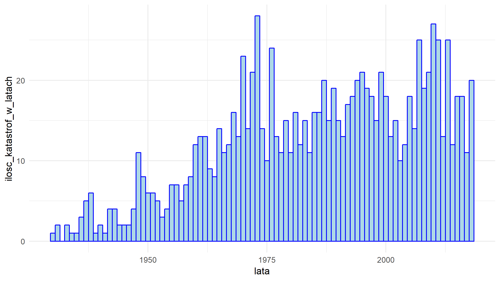
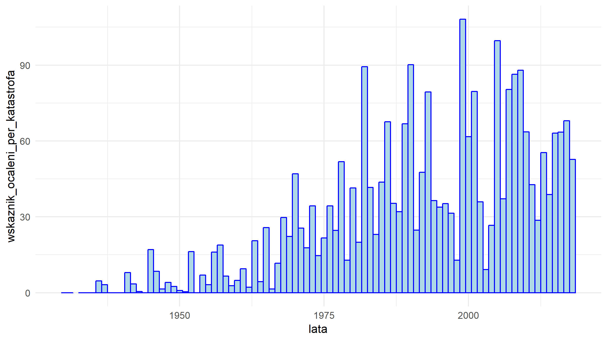

Analiza katastrof cywilnych samolotów pasażerskich w latach 1930-2018
========================================================
author: Mikołaj Zapalski Jan Proniewicz
date: 14 styczeń 2019
autosize: true
(polecam powiększyć okno na cały ekran, aby nie ucinało slajdów)

Krok 1 - pobieramy dane
========================================================


```r
library(rvest)
library(stringr)
library(ggplot2)
url<-"https://pl.wikipedia.org/wiki/Katastrofy_i_incydenty_cywilnych_samolot%C3%B3w_pasa%C5%BCerskich?fbclid=IwAR2tXXC4Z4bFOv6Ml1uVeepVWg2S7EEd53hQ2D3WLABtRH8WFLYf5MIppX8"
x<-url
parse_result<-function(x){
  read_html(x)%>%
    html_nodes("table")%>%
    html_table()->tabele
}

em<-parse_result(url)
new_em <- em[6:94] #wywalam spis tresci i lata z dziurami, czyli te które nas nie interesują
```


Krok 2 - "oczyszczamy" dane
========================================================


```r
N <- 89 # lata 1930 - 2018
J <- 9
for (n in 1:N) { #"czyszcze dane", ujednolicam format
  new_em[[n]][["Data"]][new_em[[n]][["Data"]]<1] <-str_sub(new_em[[n]][["Data"]][new_em[[n]][["Data"]]<1],start=11)
  #data w wikipedi jest róznie wpisywana, wiec staram sie to ujednolicic
  dzien <-substr(new_em[[n]][["Data"]],1,2)
  new_em[[n]][["Data"]]<-replace(new_em[[n]][["Data"]],grep("stycznia", new_em[[n]][["Data"]]),paste(toString(n+1929),"01",sep="-"))
  new_em[[n]][["Data"]] <-replace(new_em[[n]][["Data"]],grep("lutego", new_em[[n]][["Data"]]),paste(toString(n+1929),"02",sep="-"))
  new_em[[n]][["Data"]] <-replace(new_em[[n]][["Data"]],grep("marca", new_em[[n]][["Data"]]),paste(toString(n+1929),"03",sep="-"))
  new_em[[n]][["Data"]] <-replace(new_em[[n]][["Data"]],grep("kwietnia", new_em[[n]][["Data"]]),paste(toString(n+1929),"04",sep="-"))
  new_em[[n]][["Data"]] <-replace(new_em[[n]][["Data"]],grep("maja", new_em[[n]][["Data"]]),paste(toString(n+1929),"05",sep="-"))
  new_em[[n]][["Data"]] <-replace(new_em[[n]][["Data"]],grep("czerwca", new_em[[n]][["Data"]]),paste(toString(n+1929),"06",sep="-"))
  new_em[[n]][["Data"]] <-replace(new_em[[n]][["Data"]],grep("lipca", new_em[[n]][["Data"]]),paste(toString(n+1929),"07",sep="-"))
  new_em[[n]][["Data"]] <-replace(new_em[[n]][["Data"]],grep("sierpnia", new_em[[n]][["Data"]]),paste(toString(n+1929),"08",sep="-"))
  new_em[[n]][["Data"]] <-replace(new_em[[n]][["Data"]],grep("wrze", new_em[[n]][["Data"]]),paste(toString(n+1929),"09",sep="-"))
  new_em[[n]][["Data"]] <-replace(new_em[[n]][["Data"]],grep("listopada", new_em[[n]][["Data"]]),paste(toString(n+1929),"11",sep="-"))
  new_em[[n]][["Data"]] <-replace(new_em[[n]][["Data"]],grep("grudnia", new_em[[n]][["Data"]]),paste(toString(n+1929),"12",sep="-"))
  new_em[[n]][["Data"]] <-replace(new_em[[n]][["Data"]],grep("pa", new_em[[n]][["Data"]]),paste(toString(n+1929),"10",sep="-"))
  dzien <-gsub(" ","",dzien)
  dzien[strtoi(dzien)<10] <- paste0("0",dzien[strtoi(dzien)<10])
  new_em[[n]][["Data"]]<-paste(new_em[[n]][["Data"]],dzien,sep="-")
  # pewnie da się to zrobić krócej ale nam samym tym fragmentem spędziłem już za dużo czasu głownie przez to że format daty z wikipedii raz był "0000-02-1111 lutego" a raz "14 lipca" itp
  # a do tego wszystkiego grep nie obsługuje 'ś' i 'ź' więc był problem z październikiem i wrześniem ale chyba dzała w tej postaci
  for(j in 1:J)
    {
      new_em[[n]][[j]][new_em[[n]][[j]]=='?'] <- NA
    }
    #zamieniam '?' na <NA>
  }

superdane <- new_em
#eksportuję sobie do pliku .csv na wszelki wypadek ;)
lapply(superdane, function(x) write.table( data.frame(x), 'superdane.csv'  , append= T, sep=',' ))
```

```
[[1]]
NULL

[[2]]
NULL

[[3]]
NULL

[[4]]
NULL

[[5]]
NULL

[[6]]
NULL

[[7]]
NULL

[[8]]
NULL

[[9]]
NULL

[[10]]
NULL

[[11]]
NULL

[[12]]
NULL

[[13]]
NULL

[[14]]
NULL

[[15]]
NULL

[[16]]
NULL

[[17]]
NULL

[[18]]
NULL

[[19]]
NULL

[[20]]
NULL

[[21]]
NULL

[[22]]
NULL

[[23]]
NULL

[[24]]
NULL

[[25]]
NULL

[[26]]
NULL

[[27]]
NULL

[[28]]
NULL

[[29]]
NULL

[[30]]
NULL

[[31]]
NULL

[[32]]
NULL

[[33]]
NULL

[[34]]
NULL

[[35]]
NULL

[[36]]
NULL

[[37]]
NULL

[[38]]
NULL

[[39]]
NULL

[[40]]
NULL

[[41]]
NULL

[[42]]
NULL

[[43]]
NULL

[[44]]
NULL

[[45]]
NULL

[[46]]
NULL

[[47]]
NULL

[[48]]
NULL

[[49]]
NULL

[[50]]
NULL

[[51]]
NULL

[[52]]
NULL

[[53]]
NULL

[[54]]
NULL

[[55]]
NULL

[[56]]
NULL

[[57]]
NULL

[[58]]
NULL

[[59]]
NULL

[[60]]
NULL

[[61]]
NULL

[[62]]
NULL

[[63]]
NULL

[[64]]
NULL

[[65]]
NULL

[[66]]
NULL

[[67]]
NULL

[[68]]
NULL

[[69]]
NULL

[[70]]
NULL

[[71]]
NULL

[[72]]
NULL

[[73]]
NULL

[[74]]
NULL

[[75]]
NULL

[[76]]
NULL

[[77]]
NULL

[[78]]
NULL

[[79]]
NULL

[[80]]
NULL

[[81]]
NULL

[[82]]
NULL

[[83]]
NULL

[[84]]
NULL

[[85]]
NULL

[[86]]
NULL

[[87]]
NULL

[[88]]
NULL

[[89]]
NULL
```

Analiza
========================================================
Skoro dane są już obrobione przstępujemy do analizy

Wyciągamy wszystkie potrzbne nam informacje, które wykorzystamy w przyszłości

```r
zgony_w_latach<-c()
ocalenia_w_latach<-c()
wszystkie_linie_w_latach<-c()
wszystkie_kraje_w_latach<-c()
ilosc_katastrof_w_latach<-c()

for (n in 1:N){
  zgony_w_latach<-append(zgony_w_latach,sum(strtoi(superdane[[n]][["Ofiary"]]),na.rm = T))
  ocalenia_w_latach<-append(ocalenia_w_latach,sum(strtoi(superdane[[n]][["Ocaleni"]]),na.rm = T))
  wszystkie_linie_w_latach<-append(wszystkie_linie_w_latach,superdane[[n]][["Linie lotnicze"]])
  wszystkie_kraje_w_latach<-append(wszystkie_kraje_w_latach,superdane[[n]][["Miejsce zdarzenia"]])
  ilosc_katastrof_w_latach<-append(ilosc_katastrof_w_latach,length(superdane[[n]][[1]][!is.na(superdane[[n]][["Ofiary"]])]))
}
```

Ocaleni
========================================================


```r
#liczymy wektor wskażników w postaci ocalaleni/wszyscy pasażerowie dla każdego roku osobno 
procent_ocalalalych_w_latach <-round(ocalenia_w_latach/(ocalenia_w_latach+zgony_w_latach),2)

suma_ocalenia<-sum(ocalenia_w_latach)
suma_zgonow<-sum(zgony_w_latach)
round(suma_ocalenia/(suma_ocalenia+suma_zgonow),2)
```

```
[1] 0.47
```

```r
#wniosek -> statystycznie 47% szansy na ocalanie 
```
Ocaleni wykres
========================================================


```r
lata<-c(1930:2018)
aaa<-data.frame(lata,procent_ocalalalych_w_latach)
ggplot(aaa, aes(x=lata, y=procent_ocalalalych_w_latach))+geom_bar(stat="identity", width=1,color="blue",fill="lightblue")+theme_minimal()
```


Najniebezpieczniejsze linie
========================================================

```r
#najniebezpieczniejsze linie
tabela_linii <-sort(table(wszystkie_linie_w_latach),decreasing = T)
#View(tabela_linii)
tabela_linii[1:10]
```

```
wszystkie_linie_w_latach
                  Aerofłot                        TWA 
                        51                         47 
           United Airlines                     Pan Am 
                        29                         23 
         American Airlines           Turkish Airlines 
                        22                         15 
                Air France          Eastern Air Lines 
                        14                         14 
            China Airlines Polskie Linie Lotnicze LOT 
                        11                         11 
```

```r
#wynika to zapewne ze skalą przedśiębiorstw lotniczych, nie mogłem znaleźć danych
#o ilościach lotów dla lini lotniczych w tamtych latach
plot(tabela_linii[1:10],type='h',lwd=10)
```


Najniebezpieczniejsze kraje
========================================================

```r
#najniebezpieczniejsze kraje
# analogicznie do poprzedniego slajdu
tabela_krajow <-sort(table(wszystkie_kraje_w_latach),decreasing = T)
tabela_krajow[1:10] 
```

```
wszystkie_kraje_w_latach
Stany Zjednoczone              ZSRR         Indonezja   Wielka Brytania 
              269                50                39                38 
            Rosja           Francja           Japonia            Kanada 
               32                25                23                21 
           Włochy             Indie 
               21                19 
```

```r
plot(tabela_krajow[1:10],type='h',lwd=10)
```


Czy bezpieczeństwo latania zmieniało się na przestrzeni lat?
========================================================

```r
#ilośc zabitych / ilośc katastrof na przestrzeni lat
wskaznik_zgony_per_katastrofa<-zgony_w_latach/ilosc_katastrof_w_latach
#plot(wskaznik_zgony_per_katastrofa, type='h',xlab="lata")
bbb <- data.frame(lata,wskaznik_zgony_per_katastrofa)
ggplot(bbb, aes(x=lata, y=wskaznik_zgony_per_katastrofa))+geom_bar(stat="identity", width=1,color="blue",fill="lightblue")+theme_minimal()
```


TBA
========================================================
coś jescze tutaj muszę dodać i dowiedzieć się czemu wykresy sa takie małe i nie wyśrodkowane 

